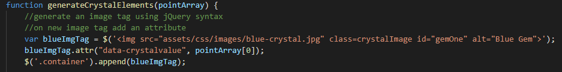

# UC Berkeley Fullstack Coding Bootcamp

# Crystal Collector

## Overveiw:
This homework assignment was to create a fun and interactive game for web browsers that dynamically updates my HTML pages with the jQuery library.

## How to play the game?
- There are four crystals displayed as buttons on the page.
- The player will be shown a random number at the start of the game.
- When the player clicks on a crystal, it will add a specific amount of points to the player's total score.
- The game will hide this amount until the player clicks a crystal.
- When the player clicks a crystal, the app updates the player's score counter.
- The player wins if their total score matches the random number from the beginning of the game.
- The player loses if their score goes above the random number.
- The game restarts whenever the player wins or loses.
- When the game begins again, the player should see a new random number. Also, all the crystals will have four new hidden values.
- The app will show the number of games the player wins and loses.

## Game in action: 

## Important code snippit:
This particaular code uses jQuery syntax to generate an image into the HTML page.

## Currently working with:

- Html
- CSS
- JavaScript
- jQuery
- GitBash
- GitLab
- GitHub

## Assignments (works in progress):

- [Profile](https://github.com/Mamitin/Basic-portfolio/blob/master/portfolio.html)
- [Portfolio](https://github.com/Mamitin/Basic-portfolio/blob/master/portfolio.html)
- [Contact](https://github.com/Mamitin/Basic-portfolio/blob/master/contact.html)
- [Wireframe](https://github.com/Mamitin/HW-Wireframe/blob/master/index.html)
- [Bootstrap Portfolio](https://github.com/Mamitin/Bootstrap-Portfolio/blob/master/index.html)
- [Crytal Collector](https://mamitin.github.io/unit-4-game/blob/master/index.html)

## Contributing
Please find me on [Linkedin](https://www.linkedin.com/in/monica-amitin-58635475/).
